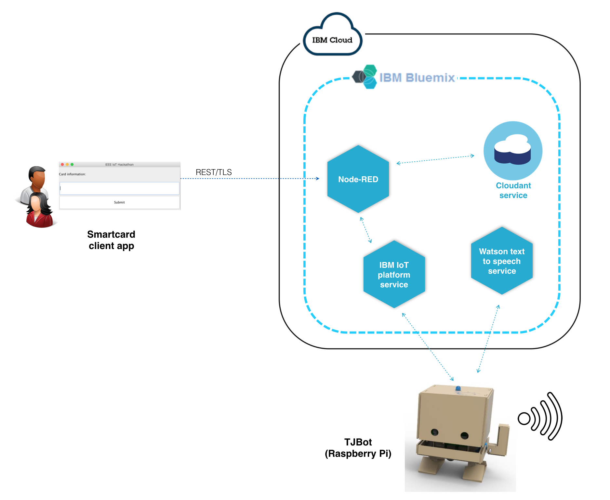
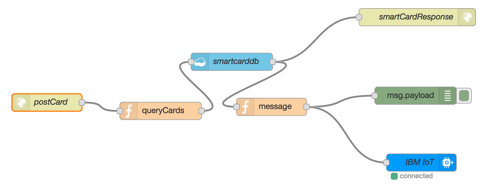
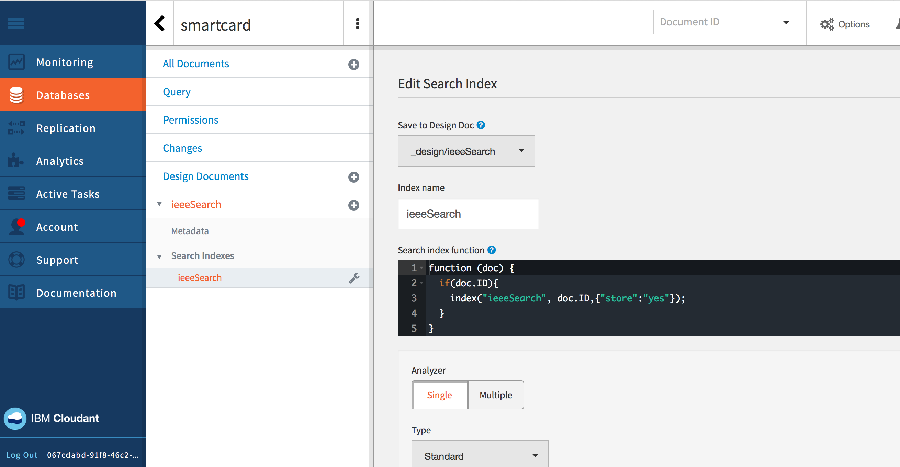

# Smart card bot recipe

This recipe provides tutorial to simulate a simple card verification system using #tjbot kit together with IBM Watson and IBM Bluemix services

## Architecture overview




## Building and connecting components together

### Server side

Server component is composed by a node-red application, a Cloudant service and an IBM IoT platform service

Go to Catalog of Bluemix, [create an Internet of Things platform starter boilerplate](https://console.ng.bluemix.net/catalog/?taxonomyNavigation=apps&category=iot&search=node-red)

The boilerplate comes with a Cloudant instance where you can store and query data, and an IoT platform service to manage and control your connected devices, apps

Import this Node-red flow into your Node-red instance which comes with the boilerplate

```
[{
    "id": "8ace248a.9f712",
    "type": "tab",
    "label": "Flow 1"
}, {
    "id": "8360792a.d6adb",
    "type": "http in",
    "z": "8ace248a.9f712",
    "name": "postCard",
    "url": "/ieee/postCard",
    "method": "post",
    "swaggerDoc": "",
    "x": 103.5,
    "y": 188.25,
    "wires": [
        ["8e776782.ff3aa8"]
    ]
}, {
    "id": "1c79a1a.4747a5e",
    "type": "cloudant in",
    "z": "8ace248a.9f712",
    "name": "smartcarddb",
    "cloudant": "",
    "database": "smartcard",
    "service": "smartcard-cloudantNoSQLDB",
    "search": "_idx_",
    "design": "ieeeSearch",
    "index": "ieeeSearch",
    "x": 420.5,
    "y": 118.25,
    "wires": [
        ["7d81b705.79f358", "2279667c.351eca"]
    ]
}, {
    "id": "7d81b705.79f358",
    "type": "http response",
    "z": "8ace248a.9f712",
    "name": "smartCardResponse",
    "x": 738.5,
    "y": 41.5,
    "wires": []
}, {
    "id": "8e776782.ff3aa8",
    "type": "function",
    "z": "8ace248a.9f712",
    "name": "queryCards",
    "func": "var str = msg.payload.card;\n\n/*var queryString = {\n    query:str,\n    limit: 1\n\n}*/\nvar queryString = \"ieeeSearch:\" + str;\n\nmsg.payload = queryString;\n\nreturn msg;",
    "outputs": 1,
    "noerr": 0,
    "x": 298.5,
    "y": 202.75,
    "wires": [
        ["1c79a1a.4747a5e"]
    ]
}, {
    "id": "b28a977e.89e5d",
    "type": "debug",
    "z": "8ace248a.9f712",
    "name": "",
    "active": true,
    "console": "false",
    "complete": "false",
    "x": 735.5,
    "y": 176.5,
    "wires": []
}, {
    "id": "2279667c.351eca",
    "type": "function",
    "z": "8ace248a.9f712",
    "name": "message",
    "func": "var message = null;\nif (msg.payload.length > 0){\n    message = 'green';\n}else{\n    message = 'red';\n}\nmsg.payload = message;\nreturn msg;",
    "outputs": 1,
    "noerr": 0,
    "x": 488.5,
    "y": 195.75,
    "wires": [
        ["b28a977e.89e5d", "386b17cf.e754f8"]
    ]
}, {
    "id": "386b17cf.e754f8",
    "type": "ibmiot out",
    "z": "8ace248a.9f712",
    "authentication": "boundService",
    "apiKey": "7076402a.839de8",
    "outputType": "cmd",
    "deviceId": "thienanbot",
    "deviceType": "RaspberryPi",
    "eventCommandType": "alert",
    "format": "string",
    "data": "default",
    "qos": 0,
    "name": "IBM IoT",
    "service": "registered",
    "x": 745.5,
    "y": 291.5,
    "wires": []
}, {
    "id": "7076402a.839de8",
    "type": "ibmiot",
    "z": "",
    "name": "RasberryPi",
    "keepalive": "60",
    "domain": "",
    "cleansession": true,
    "appId": "",
    "shared": false
}]
```

Your node-red flow will look like this:



The flow is using Duy's endpoint (https://smartcard.mybluemix.net/ieee/postCard)

Double click on each node to adjust the configuration accordingly to your setup.

Now, click on the Cloudant service and launch the administrator dashboard to create a Search index, name it ieeeSearch, under a `_design/ieeeSearch` design document.





Here is the list of card IDs imported to Cloudant database:

```
SW179
SW1715
SW173
SW1717
SW174
SW1723
SW1713
SW1721
SW1714
SW1730
SW1728
SW1734
SW1726
SW1711
SW176
SW1716
SW1720
SW1729
SW1710
SW1722
SW1727
SW1719
SW1712
SW178
SW1733
SW177
SW1732
SW1731
SW1718
SW171
```

After done with server configuration, assuming you have a node-red endpoint configured at:

`https://smartcard-test.mybluemix.net/ieee/postCard`

### Device setup

This part contains source code, instruction about how to setup the Raspberry Pi and wire parts together, as well as register to Bluemix IoT platform service.

Source code for your Raspberry Pi is here: `https://github.com/dnguyenv/smartcard-device.git`

Assuming you have your device setup following [this] instruction for TJBot. Next step is to register the device with IBM IoT platform service in Bluemix. Remember to record your register information to use later in the code, something looks like this:

```
Organization ID: xxxx
Device Type: xxxx
Device ID: xxxx
Authentication Method: token
Authentication Token: xxxx
```

From inside your device:

Clone the recipe source code:

```
$git clone https://github.com/dnguyenv/smartcard-device.git
$cd smartcard-device
$npm install
```
Put your device information (generated while registering your device in previous step) into client/device.json

```
{
        "org": "xxxxx",
        "domain": "internetofthings.ibmcloud.com",
        "type": "RaspberryPi",
        "id": "thienanbot",
        "auth-method": "token",
        "auth-token": "xxxxxxxxxxxxxxxx"
}
```

Register a Text to speech service in Bluemix and update config.js file with the credential of the service

```
// You can change the voice of the robot to your favorite voice.
exports.voice = 'en-US_LisaVoice';
// Some of the available options are:
// en-US_AllisonVoice
// en-US_LisaVoice
// en-US_MichaelVoice (the default)

//Credentials for Watson Text to Speech service
exports.TTSPassword = 'xxxxxx' ;
exports.TTSUsername = 'xxxxxx' ;

```

Run the code

```
$npm start
```

### Desktop application side

Client side is a simple desktop Java Swing application which can accept the card information red by card reader and submit the information to server component (hosted in IBM Bluemix) through a secured connection (TLS)

Clone this code

```
git clone https://github.com/dnguyenv/smartcardbot
cd smartcardbot
```

Change file CardBot.java in the client source code to use the node-red endpoint you created at server side.

Build the code:

```
sudo sh build.sh
```

Run the code:

```
sudo java -cp smartcard.jar com.ieee.smartcard.CardBotDemo
```
